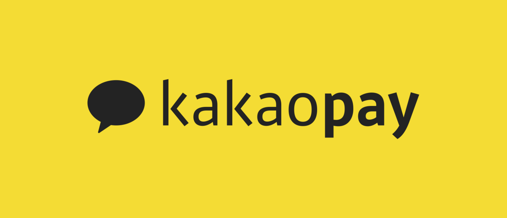

#카카오 사전 과제 저장소

*실행 방법

레디스 설치 방법 윈도우 / 리눅스
wget 

*빌드 방법

history 브라우저 히스토리 === npx serve -s build
빌드후 간단한 로컬 서버에 올려서 볼수 있다.

*프로젝트 사용 라이브러리
client

server

*폴더구조
.src
|
+-- calendar
|
|   +-- components    : 캘린더에 필요한 컴포넌트
|   |   
|   +-- Calendar.tsx  : 캘린더 컨테이너
|
+-- common
|   +-- api           : api 통신을 위한 axios 설정 폴더     
|   |
|   +-- layerpopup    : 팝업 생성/설정 관련
|   |
|   +-- popup         : 팝업 컴포넌트
|   |
|   +-- toast         : 토스트 팝업 관련
|
+-- route             : 라우팅 컴포넌트
+-- services          : 서비스 관련 
|
+-- store             : 액션 / 리듀서 / 사가 / 타입 관련
|   +-- calendar
|   |   +-- action    : 액션 함수
|   |   +-- reducer   : 리듀서
|   |   +-- sagas     : 사가 함수
|   |   +-- types     : 타입정의
|   |
|   +-- system        
|   |   +-- action    : 액션 함수
|   |   +-- reducer   : 리듀서
|   |   +-- sagas     : 사가 함수
|   |   +-- types     : 타입정의
|   |
|   +-- index.js      : 스토어 인덱스 (combineReducer, rootSaga)
|   
+-- style             : 전체 스타일
+-- utils             : 상수 / 데이트 관련 함수

*회고
redis
typescript
react-hook
nodejs
프로젝트 진행 순서에 대해 역순
test

*프로젝트 진행 

1일 캘린더 조사 및 과제 요구사항 정리
2일 ~ 3일 캐린더 뷰 등 전체 화면 작성
4일 nodejs 와 redis db로 간단한 crud 서버 구현
5일 클라이언트와 서버 연결 후 crud기능 구현
6일 테스트 및 문서작성

*문제
일정 중복
드래그 드랍
중복데이터에 대한 내용이 애매했음
완전히 시작시간과 끝시간이 같은것을 말하는것인지 시간이 겹치면 안되는것인지 애매모호 했음
구현은 시간이 겹치면 중복으로 체크하였음

